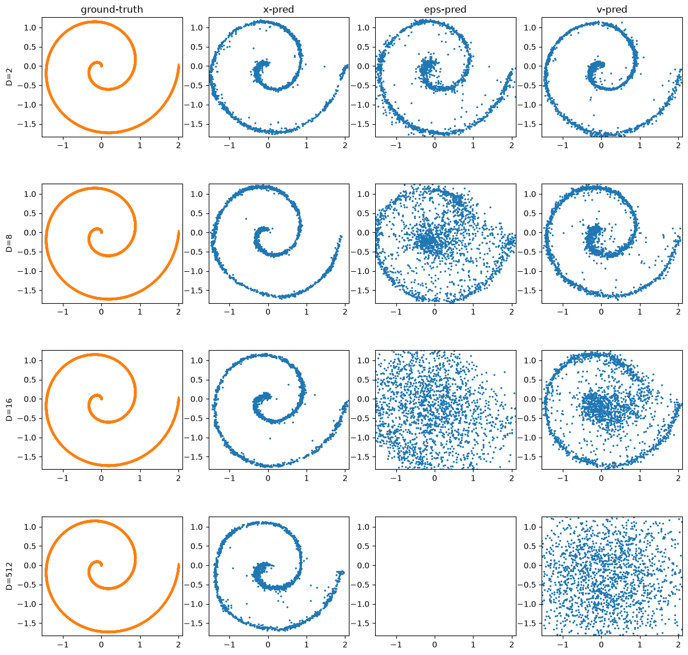
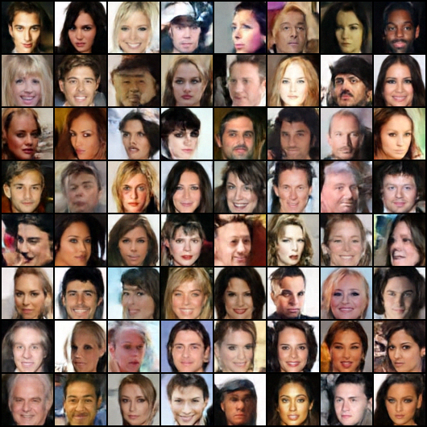

# back-to-basics

Small experiments reproducing ideas from [Back to Basics: Let Denoising Generative Models Denoise](https://arxiv.org/abs/2511.13720) (Li & He) — comparing **x**, **eps**, and **v** prediction for a pixel-space diffusion transformer on CelebA dataset.

## Results

**Toy example**: `notebooks/toy_model.ipynb`



**CelebA 64x64**, x-prediction samples:



## Setup

Run from `docker/Dockerfile` through a devcontainer. The dockerfile has pytorch requirements preinstalled. Other requirements exist in `requirements.txt`.

CelebA is downloaded via torchvision and cached as a memmap on first run (default root: `~/data/CelebA`, see `src/data.py`).

## Usage

Train (`--param` is one of `x`, `eps`, `v`; runs land in `runs/<name>_<param>_vN`):

```bash
python -m main configs/celeba64.yaml --param x
python -m main configs/celeba64.yaml --param x --resume
```

Export real images once, then samples from a run:

```bash
python -m export train --out ~/data/CelebA/fid_train
python -m export runs/celeba64_x_v1 --n 10000
```

FID:

```bash
python -m fid runs/celeba64_x_v1 runs/celeba64_v_v1
```

Monitor with `tensorboard --logdir runs`.
